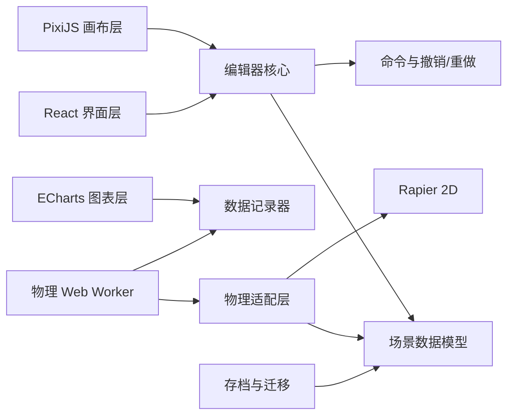

# 物理运动模拟工具：产品与代码规范

> 文档版本：0.4.0<br>
> 状态：第一版已完成<br>
> 最后更新：2026-07-21<br>
> 暂定名称：Motion Studio（名称后续可替换，不进入核心代码）

---

## 1. 文档目的

本文档同时承担四个作用：

1. 说明软件第一版要做什么、暂时不做什么。
2. 统一界面、交互、物理量和模拟规则，避免不同功能互相冲突。
3. 规定代码结构、数据格式、测试和质量标准。
4. 为未来的 3D 模拟、新物体、新场、新连接器和插件式工具保留扩展位置。

后续开发若要改变本文中的“必须”“统一”“禁止”条款，应先修改本文或新增架构决策记录（ADR），再修改代码。

---

## 2. 产品定位

这是一个面向物理学习、演示和实验搭建的二维可视化编辑器。用户像使用 Photoshop 一样，通过工具栏把地面、物体、场和连接器放进画布，再播放并观察运动过程和物理量随时间的变化。

### 2.1 核心目标

- **容易搭建**：拖、画、连接即可完成常见二维物理场景。
- **容易理解**：物理量带名称、符号和单位；错误输入给出人能看懂的提示。
- **结果可信**：单位、坐标、时间步长和近似方法公开且一致。
- **编辑顺手**：选择、移动、旋转、吸附、图层、撤销/重做符合图形编辑软件习惯。
- **方便扩展**：增加物体、场或连接器时，优先注册新类型，而不是修改大量旧代码。
- **本地优先**：第一版不要求账号或服务器，不默认发起网络请求，不加入遥测。

### 2.2 非目标与边界

第一版不是科研级有限元软件，也不承诺任意尺度下的高精度计算。第一版暂不实现：

- 3D 场景、3D 相机和 3D 刚体；
- 流体、软体、断裂、塑性形变、热学和相对论；
- 多人在线协作、云存档和账号系统；
- 任意 JavaScript 脚本或不受信任的插件执行；
- 播放过程中自由改变场景拓扑；
- 对已播放历史进行完整倒放或时间轴任意回溯。

这些功能可以后续增加，但不能为了未来功能提前破坏第一版的简单性。

---

## 3. 第一版范围（MVP）

“MVP”是第一版必须形成闭环的最小可用产品，不代表最终功能少。

### 3.1 必须具备

#### 编辑能力

- 新建、打开、保存、另存为场景。
- 选择一个或多个实体。
- 移动实体、旋转可旋转实体、删除、复制、粘贴。
- 撤销、重做；拖动一次只形成一条历史记录。
- 画布平移、缩放、框选和网格吸附。
- 图层的新建、重命名、排序、显示/隐藏和锁定。
- 右侧属性面板编辑当前选择实体的属性。

#### 地面工具

- 直线地面；
- 圆弧地面；
- 三次贝塞尔曲线地面；
- 地面为静态刚性碰撞面，不受场、力或冲量影响；
- 可设置摩擦系数、弹性系数、碰撞侧和显示样式。

#### 物体工具

- 质点：具有质量与位置；若启用碰撞，则使用可设置的微小碰撞半径；
- 小球：圆形动态刚体；
- 物块：矩形动态刚体；
- 点电荷：带电质点预设，可参与电场和电荷间作用；
- 可设置质量、尺寸、位置、角度、初速度、初角速度、摩擦系数、弹性系数、电荷量和是否启用连续碰撞检测。

#### 场工具

- 可绘制矩形、圆形和多边形作用范围；
- 匀强重力场：设置二维重力加速度向量；
- 匀强电场：设置二维电场强度向量；
- 匀强磁场：在二维画布中设置垂直屏幕的标量磁感应强度 `Bz`；
- 场范围默认用半透明颜色、边界和方向提示显示；
- 实体中心进入范围时，场开始作用；离开范围时停止作用。

#### 连接工具

- 绳：只限制最大长度，只能产生拉力，不能产生推力；
- 杆：保持两个锚点之间的固定长度，可拉也可推；
- 弹簧：遵循胡克定律，并支持沿弹簧方向的阻尼；
- 两端可以连接到物体中心或物体上的局部锚点；
- 删除端点物体时，连接器随之删除；撤销后应一起恢复。

#### 播放与数据

- 播放、暂停、单步、重置；
- 倍速至少支持 `0.25× / 0.5× / 1× / 2× / 4×`；
- 显示模拟时间；
- 选择实体并添加要观察的曲线；
- 至少支持 `x(t)`、`y(t)`、`vx(t)`、`vy(t)`、速率、加速度、角度、角速度、合力、动能；
- 支持多实体、多指标曲线，图例颜色与实体颜色一致；
- 可将记录数据导出为 CSV。

### 3.2 第一版之后优先扩展

1. 更多地面：抛物线、函数曲线、封闭多边形和导入路径。
2. 更多物体：多边形、刚体组合、带电刚体、固定点和运动学物体。
3. 更多场：中心引力、点电荷电场、非均匀场、用户安全公式场。
4. 更多连接：滑轨、铰链、阻尼器、马达、可断裂连接。
5. 测量工具：直尺、量角器、速度/力矢量、轨迹和频闪图。
6. 时间轴回放、关键帧、实验参数扫描和结果对比。
7. 3D 模式和桌面应用封装。

---

## 4. 界面结构与交互规范

### 4.1 总体布局

顶部采用两行，而不是把所有功能塞进一行：第一行是全局菜单，第二行是当前工具的选项栏。这更接近专业图形编辑器，也能容纳后续新增工具参数。

```text
┌──────────────────────────────────────────────────────────────────┐
│ 文件  编辑  视图  模拟  设置  帮助                  场景名 / 状态 │
├──────────────────────────────────────────────────────────────────┤
│ 当前工具选项：类型、吸附、尺寸、创建参数……                       │
├──────┬───────────────────────────────────────────────┬───────────┤
│      │                                               │ 图层      │
│ 左侧 │                                               ├───────────┤
│ 工具 │                 中央画布                      │ 物体属性  │
│ 栏   │                                               │           │
│      │                                               │           │
├──────┴───────────────────────────────────────────────┴───────────┤
│ 播放 / 暂停 / 单步 / 重置 / 倍速 / 时间                           │
├──────────────────────────────────────────────────────────────────┤
│ 可折叠、可调整高度的物理量—时间图表区                             │
└──────────────────────────────────────────────────────────────────┘
```

建议初始尺寸：顶部菜单 32px、工具选项栏 40px、左栏 52px、右栏 300px、底部图表 220px。右栏和底部必须可拖动调整，尺寸保存在本地偏好中。

### 4.2 顶部全局菜单

#### 文件

- 新建；
- 打开；
- 保存；
- 另存为；
- 导入场景 JSON；
- 导出场景 JSON；
- 导出画布 PNG；
- 导出记录 CSV。

#### 编辑

- 撤销、重做；
- 剪切、复制、粘贴；
- 删除；
- 全选、取消选择；
- 首选项入口。

#### 视图

- 显示/隐藏网格；
- 开启/关闭网格吸附；
- 显示/隐藏场、轨迹、速度矢量、力矢量；
- 适合画布、100% 缩放、回到世界原点；
- 显示/隐藏左右面板和图表区。

#### 模拟

- 播放/暂停；
- 单步；
- 重置；
- 倍速；
- 模拟精度设置；
- 清空记录。

#### 设置

- 外观主题；
- 网格与吸附；
- 显示精度与单位；
- 默认物理参数；
- 性能与数据记录上限。

#### 帮助

- 快捷键；
- 入门教程；
- 物理模型与近似说明；
- 关于与版本信息。

### 4.3 左侧工具栏

工具按钮使用“图标 + 悬浮名称 + 快捷键”，并按组用分隔线区分。带子类型的工具长按或点击角标打开子菜单。

| 组 | 工具 | 建议快捷键 | 行为 |
|---|---|---:|---|
| 选择 | 选择/移动 | `V` | 点击、框选、拖动、多选 |
| 选择 | 旋转 | `R` | 拖动旋转手柄或输入角度 |
| 视图 | 抓手 | `H` | 平移画布；按住空格临时启用 |
| 视图 | 缩放 | `Z` | 点击缩放或框选缩放 |
| 地面 | 直线/圆弧/贝塞尔 | `G` | 点击或拖动创建，回车完成曲线 |
| 物体 | 质点/小球/物块/点电荷 | `O` | 点击放置或拖动确定大小 |
| 场 | 重力/电场/磁场 | `F` | 先选场类型，再绘制作用范围 |
| 连接 | 绳/杆/弹簧 | `L` | 依次点击两个物体锚点 |

`Space` 保留给临时抓手，因此播放/暂停默认使用 `P`。快捷键在输入框获得焦点时不得触发。

### 4.4 中央画布

- 画布背景为低对比度中性色，网格为淡灰色。
- 世界原点显示更明显的 X/Y 轴，X 轴正方向向右，Y 轴正方向向上。
- 网格随缩放自适应显示密度，但吸附步长不因视觉网格变化而偷偷变化。
- 默认主网格间距 `1 m`，默认吸附间距 `0.1 m`；均可设置。
- 移动、创建、控制点和锚点可吸附网格。
- 旋转默认按 `15°` 吸附。
- 按住 `Alt` 临时关闭位置或角度吸附。
- 鼠标附近显示世界坐标，而不是屏幕像素坐标。
- 缩放以指针所在世界位置为中心；缩放范围初定为 `5 px/m` 至 `2000 px/m`。
- 选择框、旋转手柄、贝塞尔控制点等编辑辅助图形只存在于渲染层，不写入场景文件。

### 4.5 右侧图层与属性

#### 图层面板

- 图层顺序控制视觉叠放顺序，不用于决定物理计算顺序。
- 隐藏图层只改变显示，不应暗中关闭物理作用。
- 锁定图层只禁止编辑，不应改变模拟。
- 若要停用物理，必须使用明确的“参与模拟”开关。
- 删除非空图层前需要确认；默认提供“将实体移至其他图层”。

#### 属性面板

- 没有选择时显示场景属性；单选时显示完整实体属性；多选时只显示共同属性。
- 每个数值必须显示单位，角度在界面使用度，内部使用弧度。
- 修改后立即进行范围检查；非法值不进入场景状态。
- 支持方向向量的 X/Y 分量输入，也支持画布中的方向手柄。
- 属性分组固定为：基本信息、变换、几何、物理、初始状态、显示、高级。
- 不适用的属性不显示。例如质点不显示宽度，静态地面不显示质量和初速度。

### 4.6 底部播放与图表

- 播放控制条始终可见，图表区可以折叠。
- 播放前保存“初始场景快照”；重置必须精确恢复该快照并清空本次记录。
- 播放时默认锁定几何和拓扑编辑，仍允许选择、平移/缩放画布、切换图表和暂停。
- 若场景自上次重置后有编辑，播放按钮旁显示“将从当前编辑状态开始”。
- 图表横轴默认是模拟时间 `t / s`，纵轴显示量名、符号和单位。
- 图表悬浮提示同一时刻的多条曲线值，并允许隐藏某条曲线。
- 记录数据使用环形缓冲区，达到上限时丢弃最旧数据并给出提示。

### 4.7 快捷键最低集合

| 功能 | Windows/Linux | macOS |
|---|---:|---:|
| 保存 | `Ctrl+S` | `Cmd+S` |
| 打开 | `Ctrl+O` | `Cmd+O` |
| 撤销/重做 | `Ctrl+Z / Ctrl+Y` | `Cmd+Z / Cmd+Shift+Z` |
| 复制/粘贴 | `Ctrl+C / Ctrl+V` | `Cmd+C / Cmd+V` |
| 删除 | `Delete` | `Delete` |
| 播放/暂停 | `P` | `P` |
| 单步 | `.` | `.` |
| 重置模拟 | `Shift+R` | `Shift+R` |
| 临时抓手 | 按住 `Space` | 按住 `Space` |
| 临时关闭吸附 | 按住 `Alt` | 按住 `Option` |

---

## 5. 坐标、单位与数值规范

### 5.1 内部统一单位

物理内核和存档统一采用国际单位制（SI）：

| 物理量 | 内部单位 |
|---|---|
| 长度、位置、半径 | 米 `m` |
| 时间 | 秒 `s` |
| 质量 | 千克 `kg` |
| 角度 | 弧度 `rad` |
| 速度 | `m/s` |
| 加速度 | `m/s²` |
| 力 | 牛顿 `N` |
| 电荷量 | 库仑 `C` |
| 电场强度 | `N/C` |
| 磁感应强度 | 特斯拉 `T` |
| 弹簧劲度系数 | `N/m` |
| 阻尼系数 | `N·s/m` |

禁止把像素直接传入物理引擎。屏幕与世界坐标转换只能通过统一的 `ViewportTransform` 完成。

### 5.2 坐标与角度

- 世界坐标：X 向右、Y 向上。
- 屏幕坐标：X 向右、Y 向下；转换层负责翻转 Y。
- 正角度为逆时针。
- 存档和物理内核使用弧度；界面默认显示角度制。
- 所有向量和角度函数必须在命名或类型上表明所处空间与单位，禁止含义不清的 `x1`、`scale2`。

### 5.3 数值范围与容错

- 普通数值不得为 `NaN` 或无穷大。
- 质量必须大于 0；建议输入范围 `1e-6 kg` 至 `1e9 kg`。
- 长度和碰撞半径必须大于 0。
- 弹性系数范围为 `[0, 1]`。
- 摩擦系数范围为 `[0, 5]`，默认允许大于 1。
- 场或电荷造成极端加速度时应给出警告，而不是静默产生数值爆炸。
- 比例极端的场景应提示用户调整尺度或模拟精度。

---

## 6. 物理模型与模拟规则

### 6.1 物体分类

- **静态刚体**：地面，质量视为无穷大，不受场、力和冲量影响。
- **动态刚体**：小球、物块、带碰撞的质点，由力和碰撞决定运动。
- **理想质点**：没有旋转自由度。由于数学上的点无法可靠碰撞，开启碰撞时必须指定有限碰撞半径。
- **运动学刚体**：第一版数据模型预留，界面暂不开放；其轨迹由用户指定而不是由力决定。

### 6.2 固定时间步长

- 物理求解默认固定步长为 `1/120 s`。
- 屏幕渲染目标为 60 FPS，渲染帧率与物理步长相互独立。
- 倍速通过“每个真实时间段推进多少个固定物理步”实现，禁止通过增大单步 `dt` 实现。
- 单帧最多补算有限步数，避免窗口卡顿后出现“死亡螺旋”；落后的模拟时间应明确显示。
- 单步按钮每次精确推进一个固定物理步。
- 可在高级设置中选择更高精度，但存档必须保存该设置。

### 6.3 每一步计算顺序

每个固定步按以下顺序执行：

1. 清空上一步的自定义外力与力矩累加器。
2. 判断物体中心属于哪些场范围。
3. 计算并累加重力、电场、磁场和电荷间作用力。
4. 计算弹簧等自定义连接器的力。
5. 将外力交给刚体物理引擎，求解碰撞和关节约束。
6. 更新位置、速度、角度和角速度。
7. 计算派生量并按记录频率采样。
8. 向主线程发布轻量渲染快照。

同一层级中的场力使用同一时刻的状态计算，禁止边算边更新物体，避免结果依赖实体数组顺序。

### 6.4 场模型

#### 重力场

对质量为 `m` 的物体：

```text
F = m g
```

默认地球重力为 `(0, -9.80665) m/s²`。场可覆盖局部区域，也可设置为“无限范围”。重叠重力场的加速度直接相加。

#### 匀强电场

对电荷量为 `q` 的物体：

```text
F = q E
```

无电荷物体不受电场影响。重叠电场的电场强度向量相加。

#### 匀强磁场

二维模拟中，磁场只有垂直画布的 `Bz` 分量。对速度 `v = (vx, vy)` 的点电荷：

```text
Fx =  q · vy · Bz
Fy = -q · vx · Bz
```

`Bz > 0` 表示磁场从画布向观察者。属性面板必须使用“出屏/入屏”图标，不能只依赖正负号。

#### 点电荷间作用

点电荷预设可参与库仑力：

```text
F12 = k · q1 · q2 / r²
```

- 作用力沿两电荷连线，遵守作用力与反作用力。
- 第一版提供场景级开关，默认开启。
- 为避免 `r = 0` 的奇点，使用可见且可配置的最小计算距离（软化半径），默认取两物体碰撞半径之和，不得暗中使用魔法常量。
- 当电荷数量较少时使用成对计算；大量电荷的空间加速算法留到性能数据证明有需要时再做。

### 6.5 连接器模型

#### 绳

- 长度小于等于最大长度时不施加推力。
- 达到最大长度时通过约束阻止继续远离。
- 属性：最大长度、端点锚点、可见性；预留断裂拉力阈值。

#### 杆

- 始终保持固定长度。
- 可以承受拉力和推力。
- 属性：长度、端点锚点、是否允许端点自由转动。

#### 弹簧

沿连接方向使用：

```text
F = -k(ℓ - ℓ₀) - c · v_rel
```

其中 `k` 是劲度系数，`ℓ₀` 是原长，`c` 是阻尼系数，`v_rel` 是两个锚点沿弹簧方向的相对速度。两个端点获得大小相等、方向相反的力。

### 6.6 碰撞与材料

- 地面曲线在显示层保留精确几何，在碰撞层按屏幕不可察觉的误差自适应细分为折线段。
- 圆弧和贝塞尔地面的细分结果应缓存，只有几何改变时重建。
- 地面支持单侧或双侧碰撞；单侧地面显示法线方向，并允许翻转。
- 物体质量是用户输入的主参数；转动惯量默认根据形状和质量自动计算。
- 接触摩擦系数按 `sqrt(μ1 · μ2)` 合成。
- 接触弹性系数按 `max(e1, e2)` 合成。
- 高速小物体默认建议开启连续碰撞检测（CCD），减少穿透地面。
- 碰撞过滤使用类别与掩码，为后续“某些物体互不碰撞”预留能力。

### 6.7 能量与图表口径

- 动能、平动动能、转动动能分别可记录。
- 重力势能和弹性势能仅在参考零点定义明确时显示。
- 磁场本身不提供势能曲线。
- 摩擦、非弹性碰撞和阻尼会耗散机械能，界面不应把机械能下降误标为错误。
- “加速度”和“合力”使用物理步中的实际计算结果，不使用相邻渲染帧位置做粗糙差分。
- 所有曲线配置包含实体 ID、指标 ID、显示名、颜色和单位。

### 6.8 精度声明

帮助菜单中必须提供“物理模型与近似”页面，至少说明：

- 使用离散时间数值积分，结果存在步长误差；
- 曲线地面碰撞使用折线近似；
- 场边界默认以物体中心判断；
- 质点碰撞使用有限半径近似；
- 浮点数计算可能导致极小误差；
- 本软件适合教学、演示和常规模拟，不代替专业科研验证。

---

## 7. 状态生命周期

场景存在三个相互分离的状态：

1. **文档状态（Document）**：可保存的实体、图层、场景设置和初始条件。
2. **编辑器状态（Editor）**：选择、当前工具、面板尺寸、相机位置、悬浮目标；默认不写入物理存档。
3. **运行时状态（Runtime）**：播放后的瞬时位置、速度、接触和图表记录；不能直接覆盖文档初始条件。

```text
编辑文档 ──点击播放──> 创建初始快照 ──> 运行时世界
   ▲                                      │
   └──────────────点击重置────────────────┘
```

### 7.1 模式规则

- `editing`：允许修改文档。
- `playing`：物理世界连续推进，禁止拓扑和初始条件编辑。
- `paused`：保留运行时状态，允许查看数据，不默认写回初始条件。
- `resetting`：短暂内部状态，清理运行时并恢复初始快照。

如未来增加“将当前状态设为初始状态”，必须作为明确命令提供，不可在暂停时自动发生。

### 7.2 撤销与重做

- 使用命令模式记录文档操作，例如 `AddEntityCommand`、`MoveEntitiesCommand`。
- 连续拖动过程只在开始时记旧值、结束时记新值，形成一次可撤销操作。
- 选择变化、画布缩放、播放产生的运行时帧不进入撤销栈。
- 新操作发生后清空重做栈。
- 撤销栈默认上限 200 条；达到上限丢弃最旧记录。

---

## 8. 数据模型与存档格式

### 8.1 建模原则

- 场景数据必须是可序列化的纯数据，不包含 DOM、Pixi 对象、Rapier 句柄或函数。
- 实体 ID 使用稳定的 UUID；名称可重复，逻辑不得依赖名称查找。
- 类型使用 TypeScript 可辨识联合，避免到处使用未经检查的字符串。
- 物理引擎句柄只存在于运行时映射中，可随时由文档重建。
- 新类型通过注册表提供默认值、校验规则、属性面板定义、渲染器和物理适配器。

### 8.2 核心 TypeScript 形状

以下代码表达数据边界，具体字段可在实现时小幅调整，但不得破坏上述原则：

```ts
type EntityId = string
type LayerId = string

interface Vec2 {
  x: number
  y: number
}

interface Transform2D {
  position: Vec2       // m，世界坐标
  angleRad: number     // rad，逆时针为正
}

interface Material2D {
  friction: number
  restitution: number
}

interface BaseEntity {
  id: EntityId
  kind: 'ground' | 'body' | 'field' | 'connector'
  name: string
  layerId: LayerId
  visible: boolean
  locked: boolean
  simulationEnabled: boolean
}

type GroundGeometry =
  | { type: 'line'; start: Vec2; end: Vec2 }
  | { type: 'arc'; center: Vec2; radius: number; startRad: number; endRad: number }
  | { type: 'cubicBezier'; p0: Vec2; p1: Vec2; p2: Vec2; p3: Vec2 }

interface GroundEntity extends BaseEntity {
  kind: 'ground'
  geometry: GroundGeometry
  material: Material2D
  collisionSide: 'normal' | 'both'
  normalFlipped: boolean
}

type BodyShape =
  | { type: 'particle'; collisionRadius: number; collisionEnabled: boolean }
  | { type: 'circle'; radius: number }
  | { type: 'box'; width: number; height: number }

interface BodyEntity extends BaseEntity {
  kind: 'body'
  preset: 'particle' | 'ball' | 'block' | 'pointCharge'
  shape: BodyShape
  transform: Transform2D
  massKg: number
  chargeC: number
  material: Material2D
  initialVelocity: Vec2
  initialAngularVelocityRad: number
  continuousCollisionDetection: boolean
}

type FieldRegion =
  | { type: 'infinite' }
  | { type: 'rectangle'; center: Vec2; width: number; height: number; angleRad: number }
  | { type: 'circle'; center: Vec2; radius: number }
  | { type: 'polygon'; points: Vec2[] }

type FieldDefinition =
  | { type: 'uniformGravity'; acceleration: Vec2 }
  | { type: 'uniformElectric'; strength: Vec2 }
  | { type: 'uniformMagnetic'; bzTesla: number }

interface FieldEntity extends BaseEntity {
  kind: 'field'
  region: FieldRegion
  field: FieldDefinition
}

interface ConnectorEndpoint {
  bodyId: EntityId
  localAnchor: Vec2
}

type ConnectorDefinition =
  | { type: 'rope'; maxLength: number }
  | { type: 'rod'; length: number; freeRotation: boolean }
  | { type: 'spring'; restLength: number; stiffness: number; damping: number }

interface ConnectorEntity extends BaseEntity {
  kind: 'connector'
  a: ConnectorEndpoint
  b: ConnectorEndpoint
  connector: ConnectorDefinition
}

type SceneEntity = GroundEntity | BodyEntity | FieldEntity | ConnectorEntity
```

### 8.3 场景文件

第一版使用可读 JSON，推荐扩展名 `.motion.json`。文件顶层必须包含：

```json
{
  "schemaVersion": 2,
  "appVersion": "0.4.0",
  "metadata": {
    "name": "未命名场景",
    "createdAt": "2026-07-21T00:00:00.000Z",
    "updatedAt": "2026-07-21T00:00:00.000Z"
  },
  "settings": {
    "fixedTimeStep": 0.008333333333333333,
    "gridStep": 1,
    "snapStep": 0.1,
    "pairwiseElectrostatics": true,
    "recordingSampleRate": 60,
    "recordingDurationSeconds": 300
  },
  "layers": [],
  "entities": []
}
```

要求：

- 打开文件时先用 Zod 校验，再迁移旧版本，最后才进入应用状态。
- 未知的新字段应尽量保留，避免旧版软件保存后无意删除新版信息。
- 不允许用 `eval`、`Function` 或动态导入执行存档中的内容。
- 保存采用临时内容生成成功后再替换目标的策略，减少半写入文件。
- 浏览器不支持直接文件写入时，退化为下载文件，不假装已经覆盖原文件。
- 自动恢复草稿使用 IndexedDB；正式存档仍以用户明确保存为准。

### 8.4 版本迁移

- `schemaVersion` 每次发生不兼容格式变化时递增。
- 每个迁移函数只负责 `N -> N+1`，并有独立测试。
- 迁移必须纯函数化，不依赖界面和网络。
- 保存前始终写当前版本；读取时允许逐级升级。

---

## 9. 技术选型

### 9.1 第一版采用

| 领域 | 技术 | 选择理由 |
|---|---|---|
| 语言 | TypeScript（严格模式） | 物理量和实体类型多，静态检查可减少字段混用 |
| 应用界面 | React | 适合菜单、面板、属性表单和复杂编辑器状态 |
| 开发与构建 | Vite | 浏览器优先的单页工具，启动和构建路径直接 |
| 画布渲染 | PixiJS，生产默认 WebGL | 适合高频二维渲染、场景树、命中与图形元素 |
| 物理引擎 | Rapier 2D JavaScript/WASM | 提供刚体、碰撞、关节、CCD、传感器和快照能力 |
| 状态管理 | Zustand | 管理文档、编辑器和模拟状态，API 较轻量 |
| 数据校验 | Zod | 校验存档、表单和线程消息边界 |
| 图表 | Apache ECharts，Canvas 渲染 | 支持多序列、缩放、提示和较大时间序列 |
| 单元测试 | Vitest | 与 Vite/TypeScript 集成简单 |
| 交互测试 | Playwright | 覆盖真实浏览器中的拖绘、播放和存档流程 |
| 包管理 | pnpm | 依赖安装可复现，使用锁文件固定实际版本 |
| 桌面封装 | Tauri（第二阶段） | 保留现有 Web 前端，同时获得本地文件和桌面能力 |

依赖版本不在本文写死。项目初始化时记录在 `package.json` 和锁文件中，升级依赖必须单独提交并运行完整测试。

### 9.2 关键选型说明

- PixiJS 只负责渲染，不承担物理计算。
- Rapier 只负责刚体、碰撞和适合它的关节；场力、库仑力和弹簧口径由本项目的物理层统一管理。
- React 不应在每个物理步重新渲染所有组件；运动画面由 PixiJS 直接消费运行时快照。
- 第一版生产渲染使用 WebGL；WebGPU 只作为以后经过兼容性测试的可选项。
- 物理计算从第一版开始放入 Web Worker，避免复杂场景阻塞菜单、面板和鼠标交互。
- Tauri 不是第一版前置条件。先让 Web 版完整工作，再封装桌面版。

### 9.3 不采用的路线

- 不使用 DOM 元素逐个表示画布物体：大量运动元素会造成布局和渲染负担。
- 不从零编写完整碰撞求解器：这会把项目主要精力消耗在重复且高风险的底层问题上。
- 不把所有状态塞进一个全局对象：文档、界面和运行时的生命周期不同。
- 不在第一版引入后端：本地编辑和模拟不需要服务器。
- 不为未来 3D 现在就给所有二维向量增加无意义的 `z: 0`。

### 9.4 官方参考资料

- [React 官方文档](https://react.dev/)
- [Vite 官方指南](https://vite.dev/guide/)
- [PixiJS 8 指南](https://pixijs.com/8.x/guides/)
- [Rapier JavaScript 指南](https://rapier.rs/docs/user_guides/javascript/getting_started/)
- [Zustand 文档](https://zustand.docs.pmnd.rs/)
- [Apache ECharts 手册](https://echarts.apache.org/handbook/en/get-started/)
- [Tauri 官方文档](https://tauri.app/start/)

---

## 10. 软件架构

### 10.1 分层与依赖方向



依赖规则：

- `scene-model` 不依赖 React、PixiJS、Rapier 或浏览器 DOM。
- `physics` 不依赖 React 和界面组件。
- `renderer` 不直接修改文档，只发送编辑意图给命令层。
- `ui` 不直接操作 Rapier 句柄或 Web Worker 内部对象。
- 跨线程数据必须经过显式消息类型和运行时校验。

### 10.2 建议目录

```text
/
├─ docs/
│  ├─ adr/                         # 重要技术决策记录
│  └─ physics/                     # 物理模型和验证场景说明
├─ public/
├─ src/
│  ├─ app/                         # 应用入口、全局布局、路由/错误边界
│  ├─ components/                  # 通用界面组件
│  ├─ features/
│  │  ├─ canvas/                   # 画布容器、相机、网格、选择辅助图形
│  │  ├─ toolbar/                  # 工具栏和工具选项
│  │  ├─ inspector/                # 属性面板
│  │  ├─ layers/                   # 图层面板
│  │  ├─ playback/                 # 播放控制
│  │  └─ charts/                   # 指标选择和图表
│  ├─ editor/
│  │  ├─ commands/                 # 可撤销命令
│  │  ├─ tools/                    # 选择、移动、绘制和连接工具
│  │  ├─ snapping/                 # 网格、角度和锚点吸附
│  │  └─ selection/                # 选择模型与命中规则
│  ├─ scene/
│  │  ├─ model/                    # 纯数据类型
│  │  ├─ registry/                 # 实体/属性/工具定义注册表
│  │  ├─ validation/               # Zod 模式
│  │  └─ migrations/               # 存档迁移
│  ├─ renderer/
│  │  ├─ pixi/                     # Pixi 初始化和对象缓存
│  │  ├─ entities/                 # 各实体渲染器
│  │  └─ overlays/                 # 网格、控制点、矢量和选择框
│  ├─ physics/
│  │  ├─ adapter/                  # Rapier 句柄映射与几何转换
│  │  ├─ fields/                   # 场力
│  │  ├─ connectors/               # 自定义连接力/约束
│  │  ├─ telemetry/                # 物理量计算与采样
│  │  └─ worker/                   # Web Worker 入口和消息协议
│  ├─ stores/                      # 文档、编辑器、模拟状态
│  ├─ persistence/                 # 打开、保存、草稿和导出
│  ├─ styles/                      # 主题变量与全局样式
│  ├─ test/                        # 测试工具和固定场景
│  └─ shared/                      # 无业务归属的少量公共工具
├─ e2e/                            # Playwright 测试
├─ PROJECT_SPEC.md
└─ package.json
```

不要创建含义模糊的 `utils/` 大杂烩。工具函数优先放在实际业务模块附近；只有被多个模块稳定复用时才进入 `shared/`。

### 10.3 注册表扩展机制

每种实体或工具应在一个定义中集中声明：

- 稳定类型 ID；
- 默认数据；
- Zod 校验模式；
- 可编辑属性及单位；
- 图标和显示名称；
- 渲染器；
- 物理世界创建/更新/删除适配器；
- 可记录的物理量。

这样新增“中心引力场”时，主要是增加一个定义和实现，而不是在十几个 `switch` 中分别补分支。注册表是内部扩展机制，第一版不加载外部可执行插件。

### 10.4 Web Worker 消息原则

主线程发送：

- `initialize(sceneSnapshot)`；
- `play()`、`pause()`、`step()`、`reset()`；
- `setPlaybackRate(rate)`；
- `setTelemetrySelection(selection)`；
- 在暂停并重新初始化时发送文档变更。

Worker 返回：

- `ready`；
- `frame`：时间和各动态实体的紧凑变换数组；
- `telemetryBatch`：批量采样数据；
- `warning`：可恢复物理警告；
- `fatalError`：无法继续模拟的错误。

不为每个实体每帧发送深层 JSON 对象。第一版可用结构化克隆，性能不足时再升级为可转移的 `Float32Array`/`Float64Array`。

### 10.5 3D 扩展边界

未来 3D 应作为新的“场景维度模式”，共用文件管理、图层、材料、命令、属性描述和数据图表，但拥有独立的：

- `Vec3` / `Transform3D` 数据类型；
- 3D 相机与操作手柄；
- Three.js 等 3D 渲染适配器；
- Rapier 3D 物理适配器；
- 3D 专用几何和场定义。

不要让 3D 代码渗入当前二维核心类型。可共享概念，不强行共享不相同的实现。

---

## 11. 代码写作规范

### 11.1 TypeScript

- `strict: true`，并开启合理的未检查索引、可选属性检查。
- 禁止业务代码使用隐式 `any`；边界库确实缺类型时，局部隔离并解释原因。
- 优先使用可辨识联合和类型收窄，不使用不透明的数字枚举。
- 对外部输入、存档和 Worker 消息执行运行时校验，不能只相信 TypeScript。
- 物理公式优先写成纯函数，输入输出明确，方便单测。
- 函数默认保持短小和单一职责；超过约 40 行时检查是否应拆分，但不机械拆分。
- 文件超过约 300 行时检查是否混合了多个职责；生成代码和数据表除外。
- 禁止用布尔参数表达多个含义，例如 `createBody(true, false)`；改用命名对象。

### 11.2 命名

- React 组件、类、类型：`PascalCase`。
- 函数、变量、文件夹：`camelCase`；React 组件文件可用 `PascalCase.tsx`。
- 常量：普通模块常量用 `camelCase`，真正全局不变量可用 `UPPER_SNAKE_CASE`。
- 单位写入可能混淆的字段名：`massKg`、`angleRad`、`bzTesla`。
- 事件使用过去式或明确意图：`entityAdded`、`moveSelectionRequested`。
- 禁止缩写到难以理解；`position` 优于 `pos`，循环局部变量除外。

### 11.3 React 与状态

- 组件负责呈现和组合，物理公式不得写在组件中。
- 只订阅组件真正需要的状态切片，避免物理帧导致整个应用重渲染。
- 派生数据优先由选择器计算，不在多个 store 中重复保存。
- 文档变更必须经过命令层；临时悬浮、拖动预览可存在编辑器状态中。
- 表单保留“正在输入的文本”和“已验证的数值”差异，不能让空输入瞬间变成 `0` 或 `NaN`。
- 菜单、对话框和属性控件必须支持键盘操作及可访问名称。

### 11.4 样式

- 使用 CSS Modules + 全局设计令牌，不引入随意散落的内联颜色。
- 颜色、间距、字体、圆角、阴影和层级统一放在主题变量中。
- 默认深色专业编辑器主题，同时保证淡灰网格清楚但不抢主体。
- 实体选中、警告、锁定、隐藏、场类型不能只通过颜色区分，还需形状、图标或线型。
- 高 DPI 屏幕中画布按设备像素比渲染，世界坐标不受影响。

### 11.5 注释与文档

- 注释解释“为什么这样做”或物理近似，不重复代码表面含义。
- 公式旁注明变量意义、单位和参考方向。
- 非显然的容差、上限和软化参数必须使用命名常量并注明来源或实验依据。
- 新增核心实体/场/连接器时，同步更新本文的能力表或对应物理说明。

### 11.6 错误处理

- 用户可修复错误：在对应控件附近说明原因和修复办法。
- 可恢复模拟问题：暂停模拟、保留场景并显示警告。
- 无法恢复错误：进入错误边界，允许导出当前场景用于排查。
- 禁止空的 `catch`；日志不得包含文件内容、密钥、Token 或隐私数据。
- 生产模式默认不发送日志到网络。

### 11.7 依赖与安全

- 新增依赖前说明用途、许可证、体积和是否可由现有依赖完成。
- 锁文件必须提交。
- 不从 CDN 动态加载运行时代码。
- 不使用 `eval` 或 `new Function` 解析用户公式。
- 将来若支持公式，使用受限表达式解析器和白名单函数。
- 不把密钥、Token、`.env` 内容或登录信息写入代码和测试快照。

### 11.8 格式与检查

- 使用 ESLint + Prettier 统一格式。
- 缩进 2 空格；字符串默认单引号；是否使用分号由 Prettier 配置统一，禁止人工混搭。
- 提交前最低检查：类型检查、单元测试、代码规范检查。
- 行为改变必须同步新增或更新测试。

---

## 12. 测试与物理验证

### 12.1 测试层级

#### 单元测试

- 坐标与像素转换；
- 单位显示和弧度/角度转换；
- 网格与角度吸附；
- 场范围命中；
- 重力、电场、磁场、库仑力和弹簧力；
- 存档校验与版本迁移；
- 命令撤销/重做；
- 曲线碰撞细分误差；
- 数据指标和单位。

#### 集成测试

- 文档生成物理世界，再从运行时快照驱动画布；
- 新增、修改和删除实体后正确重建运行时映射；
- Worker 消息乱序、暂停、重置和错误恢复；
- 保存—打开后场景语义一致；
- 图层隐藏/锁定不改变物理结果。

#### 端到端测试

- 绘制地面和小球，设置重力，播放、暂停、重置；
- 创建两个物体并用绳/杆/弹簧连接；
- 修改属性并完成撤销/重做；
- 保存文件并重新打开；
- 选择曲线、运行模拟、导出 CSV；
- 键盘完成主要菜单与工具操作。

### 12.2 标准物理验证场景

每个场景使用固定初值、固定步长和数值容差：

1. **自由落体**：无碰撞时 `y(t)` 与解析解对比。
2. **斜抛运动**：`x(t)`、`y(t)` 和落地时间与解析解对比。
3. **弹性碰撞**：检查动量守恒和允许范围内的能量误差。
4. **斜面摩擦**：检查静止/滑动趋势与预期一致。
5. **单摆**：小角度周期与解析近似对比。
6. **弹簧振子**：无阻尼时周期与能量漂移，带阻尼时振幅衰减。
7. **匀强电场**：带电质点的加速度方向和大小。
8. **匀强磁场**：速度近似恒定且轨迹半径符合理论。
9. **点电荷对**：同号排斥、异号吸引，作用力成对相反。
10. **重置确定性**：相同场景、步长和输入在同一环境中重复运行，关键帧在容差内一致。

浮点物理测试使用明确容差，禁止用“完全相等”比较连续数值。

### 12.3 视觉回归

对以下固定状态保存截图基线：空白编辑器、选中物体、贝塞尔编辑、场叠加、连接器、播放图表、窄窗口。视觉测试只辅助发现变化，不能代替交互和物理测试。

---

## 13. 性能、稳定性与可访问性目标

### 13.1 第一版性能目标

在常见近年桌面浏览器、1080p 画布下，目标为：

- 200 个动态刚体、500 个静态碰撞段、10 个场、20 个连接器时，1× 播放接近 60 FPS；
- 正常编辑操作的视觉反馈在 100ms 内出现；
- 普通场景首次打开在 2 秒内可交互；
- 默认记录 60 个样本/秒，最多 10 条曲线、300 秒；
- 图表批量刷新，不按每个物理步触发 React 更新。

这些是目标而不是未经测量的承诺。性能优化必须先有性能记录，再改变架构。

### 13.2 稳定性

- 页面意外刷新后可提示恢复最近草稿。
- Worker 崩溃不得导致文档状态丢失。
- 文件打开失败不覆盖当前场景。
- 保存前后计算内容摘要；失败时保留旧文件或下载失败提示。
- 模拟出现非有限数值时立即暂停并指出相关实体。

### 13.3 可访问性

- 菜单、按钮、输入框、选项卡和面板分隔条可用键盘操作。
- 焦点样式始终可见。
- 图标按钮提供可访问名称和悬浮说明。
- 颜色对比满足 WCAG AA 的常用界面要求。
- 场类型、曲线和状态不用颜色作为唯一信息。
- 动画较多时尊重系统“减少动态效果”偏好，但物理播放本身由用户主动控制。

---

## 14. 分阶段实施顺序

### 阶段 0：工程基础

- 初始化 Vite + React + TypeScript 项目。
- 配置 pnpm、ESLint、Prettier、Vitest、Playwright。
- 建立目录、主题令牌、错误边界和持续检查命令。
- 建立最小场景模型、Zod 校验和示例存档。

完成标志：应用可启动、构建、测试；空场景可保存并重新打开。

### 阶段 1：编辑器骨架

- 完成 Photoshop 式布局、菜单、工具栏、图层和属性面板。
- 完成 Pixi 画布、相机、网格、坐标转换和吸附。
- 完成选择、移动、旋转、删除与撤销/重做。

完成标志：可以在无物理的情况下流畅创建和编辑各种占位实体。

### 阶段 2：刚体与地面

- 接入物理 Worker 和 Rapier 2D。
- 实现直线、圆弧、贝塞尔地面碰撞。
- 实现质点、小球、物块及其材料属性。
- 完成播放、暂停、单步、重置和倍速。

完成标志：小球可在曲线地面上稳定碰撞、滚动和反弹。

### 阶段 3：场与连接

- 实现重力、电场、磁场、点电荷间作用。
- 实现绳、杆、弹簧和锚点编辑。
- 增加力、速度和轨迹可视化。

完成标志：标准验证场景 5—9 通过。

### 阶段 4：图表、存档与打磨

- 完成数据记录、图表选择、CSV 导出。
- 完成正式文件流程、草稿恢复和版本迁移。
- 完成快捷键、无障碍、视觉回归和性能基准。

完成标志：本文件第 15 节验收清单全部通过。

### 阶段 5：桌面版与扩展

- 在 Web 版稳定后使用 Tauri 封装。
- 增加桌面文件关联、最近文件和系统菜单。
- 根据真实需求开始新物体、新场和 3D 的独立设计。

---

## 15. 第一版验收清单

只有以下项目全部满足，第一版才算完成：

- [x] 首次进入能看懂菜单、工具栏、画布、属性、图层和播放区的分工。
- [x] 能创建直线、圆弧和贝塞尔地面，控制点编辑正常。
- [x] 能创建质点、小球、物块和点电荷。
- [x] 能创建矩形、圆形、多边形或无限范围的重力/电场/磁场。
- [x] 能用绳、杆、弹簧连接两个有效锚点。
- [x] 选择、移动、旋转、吸附、多选、删除和撤销/重做一致可靠。
- [x] 图层隐藏和锁定不会偷偷改变模拟结果。
- [x] 播放、暂停、单步、倍速和重置行为符合固定步长规则。
- [x] 属性编辑显示正确单位，非法值不会进入场景。
- [x] 至少可同时绘制两个实体的多个物理量时间曲线。
- [x] 可以导出 CSV，并且表头含指标和单位。
- [x] 保存后重新打开，实体、图层、参数和视图约定的数据不丢失。
- [x] 物理标准验证场景全部在规定容差内通过。
- [x] 达到或诚实记录第 13 节性能目标的测试结果。
- [x] 主要操作可用键盘完成，错误信息能指导用户修正。
- [x] 无默认遥测、无不必要网络请求、无动态执行存档内容。

---

## 16. 开发中必须维护的决策记录

以下问题在真正实现到对应阶段时，应在 `docs/adr/` 中写一页简短 ADR，记录选择、原因和替代方案：

1. Rapier 具体版本、WASM 加载方式和确定性设置。
2. 单侧曲线地面的碰撞实现和自适应细分误差。
3. Rapier 材料系数与本规范合成规则之间的适配方式。
4. Worker 帧数据使用结构化克隆还是 TypedArray。
5. 浏览器文件 API 的能力检测、保存回退和草稿恢复策略。
6. 图表缓存上限与长时间实验数据降采样策略。
7. Tauri 封装时的权限最小化和文件关联方案。
8. 3D 模式的数据共享边界。

---

## 17. 给后续开发者的最短检查表

每次开始一个功能前先问：

1. 这是文档状态、编辑器状态，还是运行时状态？
2. 输入使用的单位是什么，是否在边界完成了转换和校验？
3. 新功能能否通过注册表加入，而不是修改许多旧分支？
4. 物理计算是否脱离 React，并保持固定时间步长？
5. 操作是否应进入撤销栈，拖动是否只记一条历史？
6. 保存后能否恢复，旧文件如何迁移？
7. 正常路径、错误路径和一个物理验证场景是否都有测试？
8. 这个变化是否需要更新本文或新增 ADR？

如果这八个问题都有明确答案，代码通常就不会偏离项目方向。
